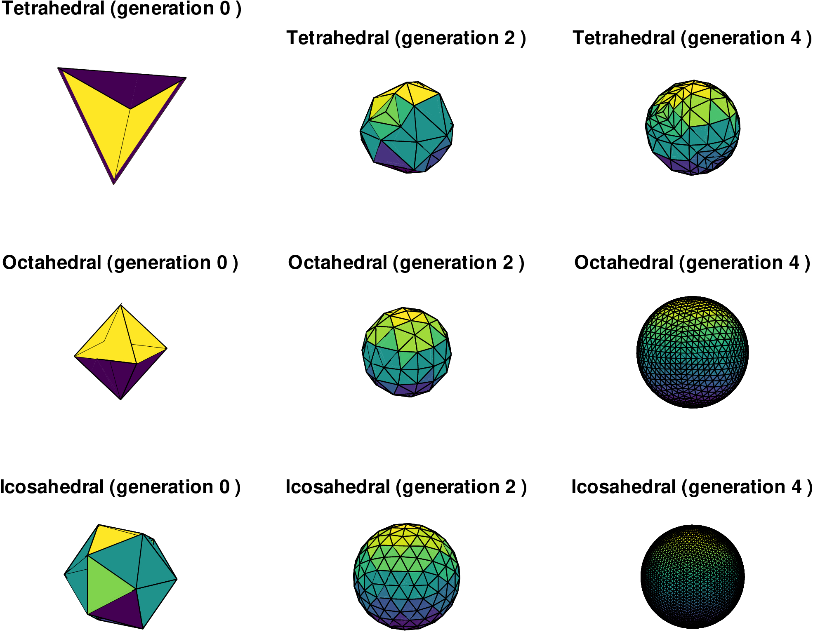

# `SphereMesh`: Delaunay mesh on the surface of a sphere

This Matlab/Octave code base provides routines to create Delaunay meshes on the surface of a unit sphere, by recursively bisecting the edges of chosen regular polyhedrons (in particular, Platonic solids). 

## Usage: 
```matlab
% For Matlab/Octave
[ P, tri ] = generateSphereMesh( generation, type );
```
### Input parameters:
1. `generation` is the number of recursive bisections desired. The more this value, the finer the mesh, but also the larger the output arrays. If `generation` is set to zero, then the surface meshes of the original platonic solids are returned. A value of 3 or 4 for an icosahedral mesh results in approximately equal-sized triangular mesh elements. The node positions in these high-density cases can be used as an approximation for uniform sampling of a sphere.
1. `type` can currently take three string values: `tet`, `oct` and `ico` for tetrahedral, octahedral and icosahedral starting shapes respectively. 

### Outputs:
1. `P` is a 3XN array of 3D points on the unit sphere (norm of each column is 1) which denote the mesh nodes. 
1. `tri` is a Mx3 integer array whose rows denote the vertices of each triangular mesh element. 

The spherical mesh can ve visualized in Matlab/Octave with the command:
```matlab
figure; 
trisurf( tri, P(1,:), P(2,:), P(3,:), 'EdgeColor', 'k' );
axis image; 
```

## Examples

